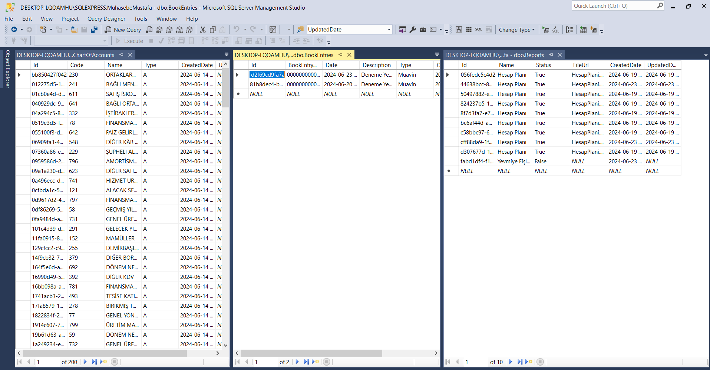

# Muhasebe Uygulaması

Bu proje, Clean Architecture ve Angular kullanılarak geliştirilmiş bir online muhasebe programıdır. Proje, modüler yapıda tasarlanmış olup, aşağıdaki başlıkları içermektedir:

## Proje Amaçları

- Çok kiracılı (multitenant) database yapısı üzerine kurulu bir muhasebe yazılımı geliştirme
- CQRS pattern kullanarak şirket oluşturma ve veritabanı migrasyon işlemleri
- Repository pattern, Unit of Work, UCAF (User/Company/Account/Financial Transaction) kayıt işlemleri

## Teknolojiler

- **Backend**: ASP.NET Core, Entity Framework Core, CQRS, Fluent Validation, Moq, JWT Authentication, Swagger
- **Frontend**: Angular, Admin LTE, Toastr, ngRx, CryptoJS
 

## Katmanlı Mimari

### 1. Presentation Layer (Sunum Katmanı)
- Angular ile kullanıcı arayüzünü oluşturur.

### 2. WebAPI Layer (WebAPI Katmanı)
-RESTful API'ları oluşturur ve sunar. 

### 3. Application Layer (Uygulama Katmanı)
- İş mantığını yönetir.

### 4. Domain Layer (Alan Katmanı)
- Temel iş mantığını içerir.

### 5. Infrastructure Layer (Altyapı Katmanı)
- Dış servislerle iletişim gibi altyapı işlemlerini yönetir.

### 6. Persistence Layer (Kalıcı Katmanı)
-  Veritabanı erişimini yönetir.

### 7. Unit Test Layer (Birim Test Katmanı)
-  Uygulamanın iş mantığını ve veri katmanlarını test etmek için kullanılır.

## Kurulum

1. **Backend'i başlatın:**
    ```sh
    cd server
    dotnet restore
    dotnet run
    ```

2. **Frontend'i başlatın:**
    ```sh
    cd client
    npm install
    ng serve
    ```
  2. **Veritabanı için:**
- Veritabanı bağlantısını appsettings.json dosyasında yapılandırın.
  
## Ekran Görüntüleri




## Proje İçeriği ve İlerleme

1. **Proje Başlangıcı**
   - Proje temeli oluşturuldu, repository pattern ve dependency injection yapılandırıldı.

2. **Database Yapısı**
   - Multitenant database yapılandırması gerçekleştirildi.Farklı müşteriler için veritabanı yapısını ayırmak amacıyla kullanılmıştır.

3. **CQRS Pattern ve Şirket Yönetimi**
   - CQRS pattern kullanılarak şirket oluşturma işlemleri yapıldı, veritabanı migrasyonları tamamlandı.

4. **Repository Pattern ve Unit Of Work**
   - Repository pattern ve unit of work yapıları detaylandırıldı, UCAF kayıt işlemleri entegre edildi.

5. **IoC Container ve AsNoTracking**
   - IoC container konfigürasyonları temizlendi, performans iyileştirmeleri için AsNoTracking kullanıldı.

6. **Authentication ve Authorization**
   - JWT tabanlı authentication entegrasyonu yapıldı, Options pattern ile konfigürasyonlar yönetildi.

7. **Role Yönetimi**
   - Rol yönetimi için CRUD işlemleri eklendi, kullanıcı rolleri yönetimi güncellendi.

8. **Exception Handling ve Validation**
   - Global exception handler ve Fluent Validation entegrasyonları tamamlandı, record tipleri kullanıldı.

9. **Unit Testler**
   - Moq framework kullanılarak unit testler yazıldı, temel iş mantığı test edildi.

10. **Ana Hesap Planı Yönetimi**
    - Ana hesap planı oluşturma, listeleme, güncelleme ve silme işlemleri yapıldı.

## ÖRNEK KODLAR
### AsNoTracking Örneği
AsNoTracking metodu, Entity Framework Core üzerinde performansı artırmak için kullanılır. Bu özellikle sorgulanan nesnelerin veritabanından çekilirken DbContext tarafından takip edilmemesini sağlar. Bu durumda, çekilen verilerin değişikliklerini takip etmek için gereksiz bellek tüketimi ve performans kaybı önlenir.
```csharp
    public async Task<T> GetFirstByExpiression(Expression<Func<T, bool>> expression, CancellationToken cancellationToken = default, bool isTracking = true)
    {
        T entity = null;
        if (!isTracking)
            entity = await Entity.AsNoTracking().Where(expression).FirstOrDefaultAsync();
        else
            entity = await Entity.Where(expression).FirstOrDefaultAsync();

        return entity;
    }
```


### Moq ile Unit Test Örneği
Moq ile Unit Test yapmak, test sürecini daha yönetilebilir ve tekrarlanabilir hale getirir.Kodun izolasyonu,hata ayıklama kolaylığı sağlar ve kodun nasıl kullanılması gerektiği ve beklenen sonuçların ne olduğu konusunda belge niteliği taşır.
```csharp
     [Fact]
    public async Task CompanyShouldBeNull()
    {
        Company company = (await _companyService.Object.GetCompanyByName("Mustafa LTD ŞTİ", default))!;
        company.ShouldBeNull();
    }
```

### CancellationToken Kullanımı
Asenkron işlemler, uzun sürecek veya beklenmedik bir şekilde uzayacak işlemler olabilir. CancellationToken, bu tür durumlarda kullanıcının veya uygulamanın işlemi iptal etmesini sağlar. Örneğin, kullanıcı bir web isteğini iptal etmek isterse veya uygulama bir zaman aşımı süresi belirlerse, CancellationToken kullanılarak işlem durdurulabilir.
```csharp
public async Task<IActionResult> GetAccounts(CancellationToken cancellationToken)
{
    var accounts = await _accountService.GetAccountsAsync(cancellationToken);
    return Ok(accounts);
}
```

Bu örnekler, projenin çeşitli katmanlarında nasıl çalışıldığını ve hangi araçların kullanıldığını göstermektedir. Detaylı dokümantasyon ve ek bilgiler için projenin kaynak koduna göz atabilirsiniz.
